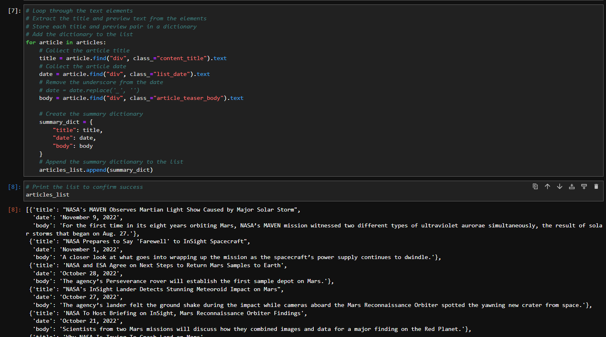

# Web scraping with Beautiful Soup to get data about Mars

#### Deliverable 1 `part_1_mars_news.ipynb` scrapes titles and preview text from Mars News webpage
#### Deliverable 2 `part_2_mars_weather.ipynb` scrapes and analyzes Mars Weather Data webpage and the csv output from that scraping activity is in the Resources directory

#### Directory structure:   
📦scraping-challenge   
 ┣ 📂Resources   
 ┃ ┗ 📜mars_data.csv   
 ┣ 📜part_1_mars_news.ipynb   
 ┣ 📜part_2_mars_weather.ipynb    
 ┣ 📜screenshot.png   
 ┗ 📜README.md 
